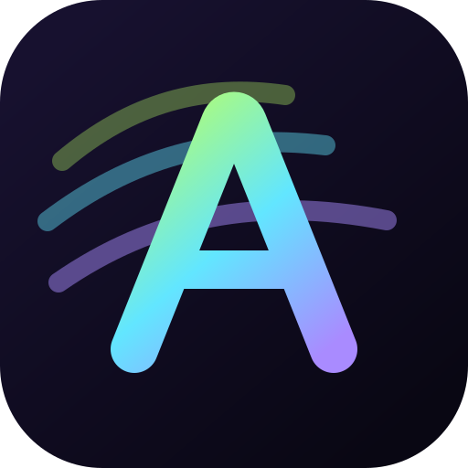

# Animaxxing Skills



AI agent skills for ambitious, production-ready animation with [GSAP](https://gsap.com), in two families. **Framework skills** teach an agent how a framework's routing, rendering, and cleanup change what GSAP code must do, so pages and components animate in and out without jank, flashes, or leaks. **Aesthetic skills** each carry one complete look, from design tokens and typography to portable effect recipes, and hand their motion to a framework skill's lifecycle.

These skills sit above the [official GSAP skills](https://github.com/greensock/gsap-skills), which cover the GSAP API itself. Install both.

[Agent Skills](https://agentskills.io) format. Works with the [skills CLI](https://github.com/vercel-labs/skills), Claude Code, Cursor, Codex, Copilot, and 40+ agents.

## Installing

### npx skills (recommended)

```bash
npx skills add https://github.com/greensock/gsap-skills
npx skills add https://github.com/johnpolacek/animaxxing-skills
```

The CLI auto-detects the installed agent. To target one explicitly, pass `--agent`:

```bash
npx skills add https://github.com/johnpolacek/animaxxing-skills --agent cursor
```

### Claude Code

```text
/plugin marketplace add johnpolacek/animaxxing-skills
```

See the [Agent Skills docs](https://docs.anthropic.com/en/docs/agents-and-tools/agent-skills/overview).

### Cursor

**Settings → Rules → Add Rule → Remote Rule (GitHub)** and use `johnpolacek/animaxxing-skills`. Or install via `npx skills add` above.

### Clone / copy

Copy the folders under `skills/` into your agent's skill directory:

| Agent | Skill Directory |
|-------|-----------------|
| Claude Code | `~/.claude/skills/` |
| Cursor | `~/.cursor/skills/` |
| OpenAI Codex | `~/.codex/skills/` |
| OpenCode | `~/.config/opencode/skills/` |
| Google Antigravity | `~/.gemini/antigravity/skills/` |

## Skills

### Framework skills

| Skill | Description |
|-------|-------------|
| **gsap-vanilla** | Plain HTML, CSS, and JavaScript sites: initial state before first paint, outro before a link is followed, cross-document View Transitions with `pageswap` and `pagereveal`, the bfcache, prerendering, fetch and swap routers, and Swup, Barba, or Taxi hooks |
| **gsap-astro** | Astro: page transitions under `<ClientRouter />`, outro before the swap through `astro:before-preparation`, cleanup in `astro:before-swap`, initial state on the incoming document, rehooking on `astro:page-load`, `transition:persist` and islands, `transition:animate` versus GSAP, back and forward, prefetch |
| **gsap-sveltekit** | SvelteKit on Svelte 5: page transitions, enter and exit motion across client-side navigation, show and hide of conditional content, scroll-driven effects, GSAP versus Svelte `transition:` directives versus View Transitions, `beforeNavigate` and `onNavigate` outros, page reuse and `{#key}`, back and forward, runes cleanup |
| **gsap-nuxt** | Nuxt 3 and 4: page and layout transitions through the `pageTransition` JavaScript hooks and `done`, what dies when the leave starts, `out-in` versus overlap, page keys and `keepalive`, Nuxt app hooks, scroll and focus, outro before navigation, back and forward, `experimental.viewTransition`, SSR first paint |
| **gsap-react-router** | React Router v7 and v8 (framework, data, declarative modes): page transitions, enter and exit motion, show and hide of conditional content, scroll-driven effects, GSAP versus `viewTransition`, `useBlocker` as the only hold on navigation, transition-aware links, route reuse and `<Outlet>` keys, `useNavigation` pending UI, back and forward, `ScrollRestoration`, SSR and SPA mode first paint |
| **gsap-tanstack-router** | TanStack Router for React and TanStack Start: page transitions, outro before navigation with `useBlocker`, pending components and `pendingMs`, route reuse and `remountDeps`, `router.subscribe` events, back and forward, `viewTransition`, scroll restoration, SSR first paint with `ScriptOnce` |
| **gsap-nextjs** | Next.js App Router: page transitions, enter and exit motion, show and hide of conditional content, scroll-driven effects, GSAP versus React View Transitions, route lifetime under `cacheComponents`, transition-aware links, back and forward, cleanup |

### Aesthetic skills

| Skill | Description |
|-------|-------------|
| **aesthetic-animaxxing** | The Animaxxing look: monochrome editorial design in Rethink Sans and JetBrains Mono, poster-scale type, hairline rules, light and dark schemes, and a motion vocabulary of split-text entrances, a headline that scatters in from off screen, paragraphs spoken in word by word, a letter wave, particle-assembled buttons and cards, and a blast-off outro. Tokens in plain CSS and Tailwind v4, type and layout grammar, and vanilla TypeScript plus GSAP recipes |

## Composing a framework skill with an aesthetic

Install both. The framework skill comes first: it owns the lifecycle below, navigation timing, interruption, and cleanup. The aesthetic skill owns what each phase looks like. Its recipes are vanilla modules that return timelines or `enter`/`exit`/`blast`/`idle` instances, and the framework skill's controller decides when to call them.

Ask the agent to "animaxx it" and it will apply the tokens, type roles, and layout grammar, mark the page for the route transition, and wire the surface effects where the page has a display surface for them.


## The lifecycle

Every skill uses the same model. An animated page or component runs through:

**mount → initial state → intro → settled → outro → end state → unmount**

Mount and unmount belong to the framework. The five phases between them belong to the animation code and happen while the node exists. Each skill explains how its framework decides when those phases run, what can interrupt them, and what must be cleaned up.

## Structure

```text
animaxxing-skills/
  README.md
  CHANGELOG.md
  AGENTS.md              # Guidance for agents editing this repo (CLAUDE.md and GEMINI.md are copies)
  LICENSE
  assets/
    logo.svg             # Marketplace and repository mark
  .claude-plugin/        # Claude Code plugin config (plugin.json, marketplace.json)
  .cursor-plugin/        # Cursor plugin config (plugin.json, marketplace.json)
  .github/
    copilot-instructions.md
    workflows/validate.yml
  skills/
    llms.txt             # Skill index for agents (names, summaries, trigger terms)
    gsap-vanilla/
      SKILL.md
      agents/openai.yaml
      references/
        page-load.md
        cross-document-navigation.md
        spa-navigation.md
        motion-system.md
        verification.md
    gsap-astro/
      SKILL.md
      agents/openai.yaml
      references/
        client-router-navigation.md
        scripts-and-islands.md
        motion-system.md
        verification.md
    gsap-sveltekit/
      SKILL.md
      agents/openai.yaml
      references/
        sveltekit-navigation.md
        page-lifetime.md
        motion-system.md
        verification.md
    gsap-nuxt/
      SKILL.md
      agents/openai.yaml
      references/
        page-transitions.md
        navigation.md
        motion-system.md
        verification.md
    gsap-react-router/
      SKILL.md
      agents/openai.yaml
      references/
        react-router-navigation.md
        route-lifetime.md
        motion-system.md
        verification.md
    gsap-tanstack-router/
      SKILL.md
      agents/openai.yaml
      references/
        tanstack-navigation.md
        route-lifetime.md
        motion-system.md
        verification.md
    gsap-nextjs/
      SKILL.md
      agents/openai.yaml # Codex display metadata
      references/
        app-router-navigation.md
        motion-system.md
        verification.md
    aesthetic-animaxxing/
      SKILL.md
      agents/openai.yaml
      references/
        tokens.md
        typography-and-layout.md
        motion-vocabulary.md
        verification.md
        recipes/
          split-entrances.md
          route-letters.md
          speak-in.md
          wave.md
          blast-off.md
          particle-field.md
          particle-effects.md
```

## Verification

[animaxxing-skills-test](https://github.com/johnpolacek/animaxxing-skills-test) holds, for each framework, a starter site, the task prompt an agent is given, a reference implementation built by following the skill, and Playwright specs that assert the lifecycle behavior the skill promises: no flash before the intro, a clean settled state, an outro that finishes before navigation, intro-only history, one navigation at a time, interruptible intros, reduced motion through every phase, and cleanup. Its eval script rebuilds a framework's app from the starter with Claude Code and runs the specs against the result.

Aesthetic skills are verified against the demo that wears them: the [Animaxxing](https://github.com/johnpolacek/animaxxing) site is the reference for `aesthetic-animaxxing`, and the skill's own `references/verification.md` lists the checks. An aesthetic suite in the test repository is planned.

## Demo

The [Animaxxing](https://github.com/johnpolacek/animaxxing) repository holds a Next.js showcase that consumes these skills as a real project and validates their guidance against navigation, interruption, accessibility, responsive layout, and cleanup requirements. Its own look is what `aesthetic-animaxxing` carries, and its install page at `/animaxx` walks through installing the skills.

## Contributing

Read [AGENTS.md](AGENTS.md) before adding or editing a skill. New skills must follow the shared lifecycle and gate advice on framework versions. Framework skills stay free of project-specific design; aesthetic skills are a design, and stay free of any framework.

Run the same checks as CI before opening a pull request:

```bash
for skill in skills/*/; do uvx --from skills-ref==0.1.1 agentskills validate "$skill"; done
npx --yes skills@1.5.23 add . --list
```

## Releasing

This repository uses semantic versions for its Claude and Cursor plugin manifests. To publish a release:

1. Add the user-visible changes to `CHANGELOG.md`.
2. Set the same version in every version field in `.claude-plugin/plugin.json`, `.cursor-plugin/plugin.json`, and `.cursor-plugin/marketplace.json`.
3. Run the validation workflow locally or wait for CI to pass on `main`.
4. Tag the commit as `v<version>` and create the matching GitHub release.

## License

MIT
